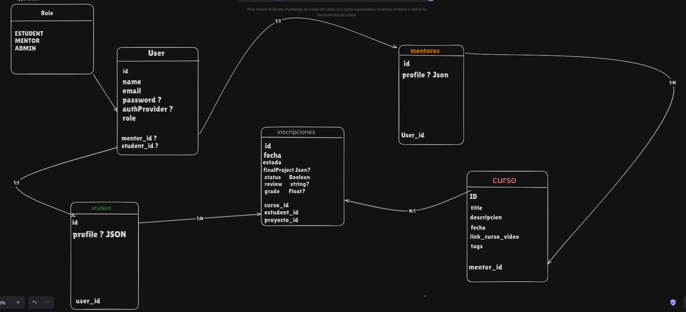

# Para la version 1

- el admin creara tanto mentores como cursos

# Para la version 2

# EDULINKS - Documentación

solo es una guia, pueden aportar y mejorar lo que quieran, gracias.

## Descripción General

**EDULINKS** es una plataforma de inscripción de cursos que permite la creación y administración de cursos por parte de mentores, y la inscripción de estudiantes con un perfil para tener seguimiento de su progreso.

## Roles y Permisos

### Mentor

- **Creación y Administración de Cursos:** Los mentores tienen la capacidad de crear y administrar sus propios cursos.
- **Permisos:** Los mentores pueden dar de alta y baja a los cursos que hayan creado.

### Usuario

- **Rol Predeterminado:** Al momento de crear un usuario, este será registrado automáticamente como `Student`.
- **Asignación de Mentores:** Los mentores se asignan manualmente desde un panel ADMIN.

## Cursos

- **Contenido del Curso:**
  - **Video:** Cada curso tiene un enlace a un video (por defecto, de YouTube). La URL del video puede cambiarse en el futuro.
  - **Título:** El título del curso es definido por el mentor.
  - **Descripción:** Una breve descripción del curso proporcionada por el mentor.
  - **Nota Final:** La nota final es creada por el mentor.
  - **Proyecto Final:** Los cursos incluirán un proyecto final que los estudiantes deben completar y entregar antes de una fecha límite establecida por el mentor.

## Inscripción

- **Estudiantes:** Los estudiantes se inscriben en los cursos que los mentores han creado.
- **Restricciones:** Una vez inscritos en un curso, los estudiantes no podrán darse de baja.
- **Entrega de Proyecto Final:** El proyecto final solo puede ser entregado hasta la fecha límite establecida. Una vez entregado, el mentor proporcionará una reseña junto con la calificación.
- **Gestión de Proyectos Finales:** Almacena la información del proyecto final.
- **Evaluaciones:** Permite al mentor proporcionar feedback y calificar el proyecto final.

## consideraciones, cosas sin concluir o mejoras

- **como obtener mas informacion para el seguimiento del estudiante?**

## Imagen del DER

